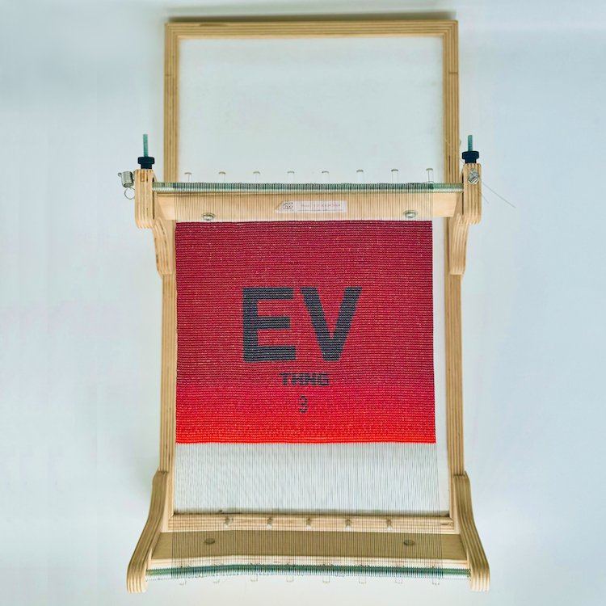
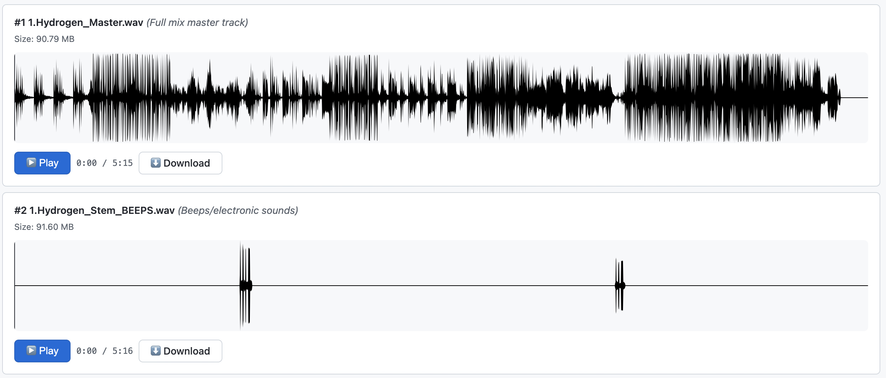
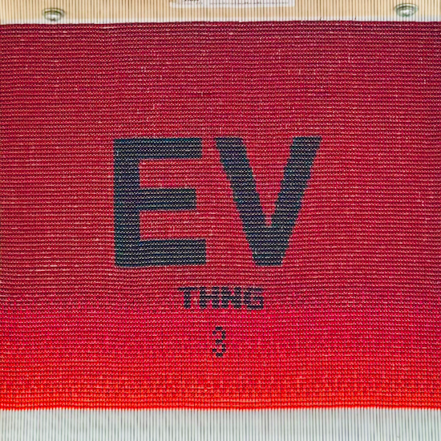

# Everything is Free

  
   

  

An open, zero-restriction release of **Software-Entwicklungskit’s** album [Everything is Free](https://software-entwicklungskit.bandcamp.com/album/everything-is-free).

All audio stems, artwork, lyrics, and information in this repository are released under **Creative Commons Zero v1.0 Universal (CC0 1.0)** — meaning:

> **You may use, remix, transform, sample, commercialize, or redistribute these files with absolutely no restrictions and no attribution required.**

---

## 🎵 Tracks
  
 

| # | Track | BPM | Key | Links |
|:---|:---|:---|:---|:---|
| 1 | [Hydrogen](src/1.Hydrogen) | 132 | D Major | [Listen & Download Stems](https://ev3.ichbinsoftware.com/hydrogen) |
| 2 | [Lithium](src/2.Lithium) | 124 | G minor | [Listen & Download Stems](https://ev3.ichbinsoftware.com/lithium) |
| 3 | [Sodium](src/3.Sodium) | 140 | G minor | [Listen & Download Stems](https://ev3.ichbinsoftware.com/sodium) |
| 4 | [Potassium](src/4.Potassium) | 90 | C Major | [Listen & Download Stems](https://ev3.ichbinsoftware.com/potassium) |
| 5 | [Rubidium](src/5.Rubidium) | 132 | G Major | [Listen & Download Stems](https://ev3.ichbinsoftware.com/rubidium) |
| 6 | [Caesium](src/6.Caesium) | 130 | C Major | [Listen & Download Stems](https://ev3.ichbinsoftware.com/caesium) |
| 7 | [Francium](src/7.Francium) | 128 | B flat | [Listen & Download Stems](https://ev3.ichbinsoftware.com/francium) |

---

## 🎨 Artwork

Digital artwork by **Maubere**.

Bead work by **Beadhammer**.

### Main  

### Beadwork  

---

## ⚖️ License

This work is dedicated to the public domain under  
**Creative Commons Zero v1.0 Universal (CC0 1.0)**.

You may copy, modify, distribute, perform, remix, sample, or commercialize this work  
**without permission, credit, or restriction**.

---

## 👥 Credits
- **Music & Production:** Software-Entwicklungskit | [@ichbinsoftware](https://www.instagram.com/ichbinsoftware/)
- **Artwork:** Maubere  
- **Beadwork:** Beadhammer | | [@beadhammer](https://www.instagram.com/beadhammer/)