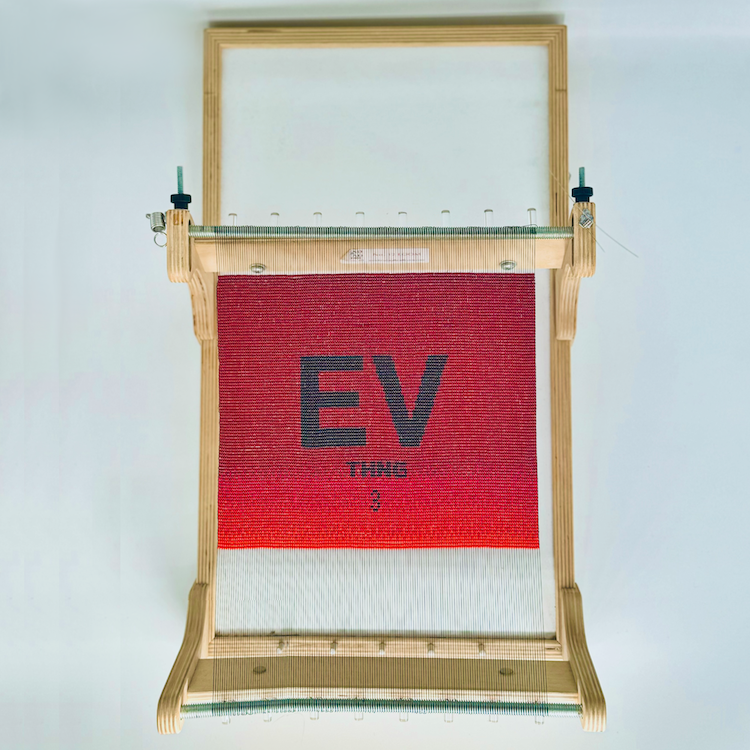
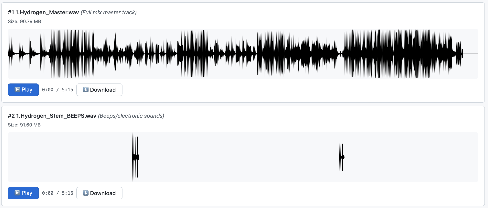
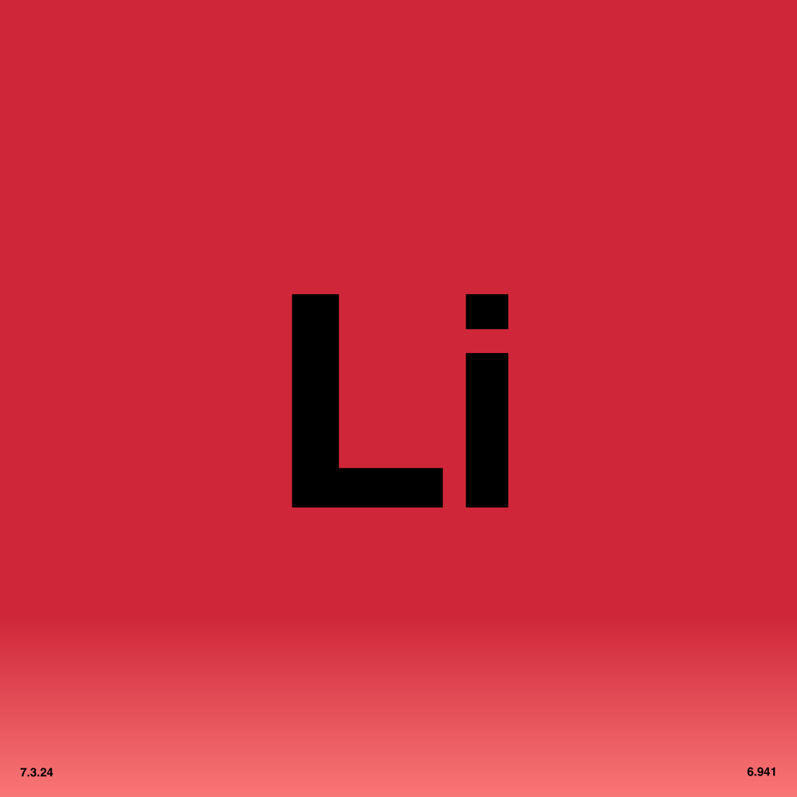
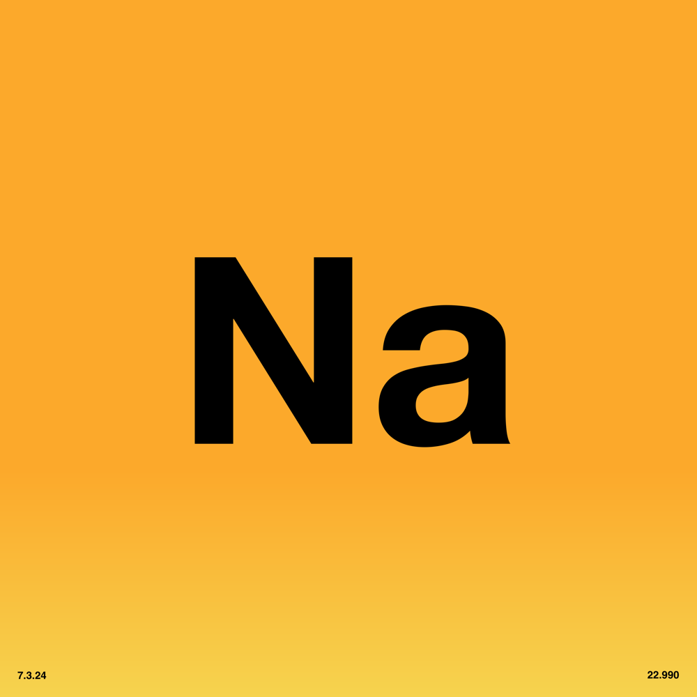
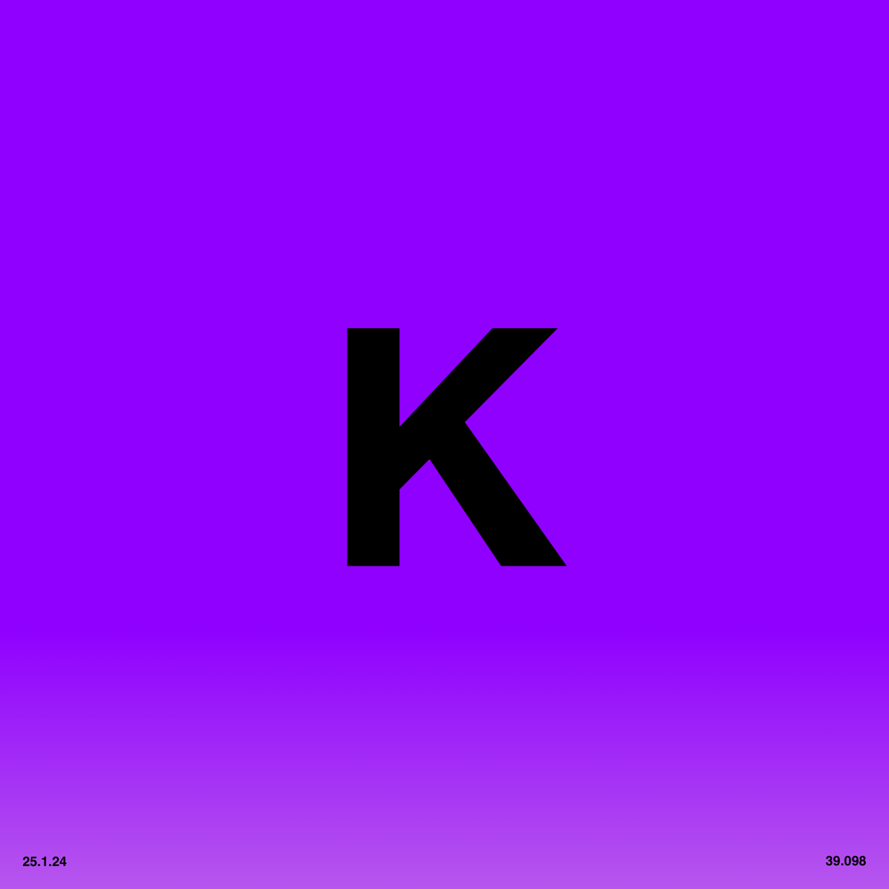
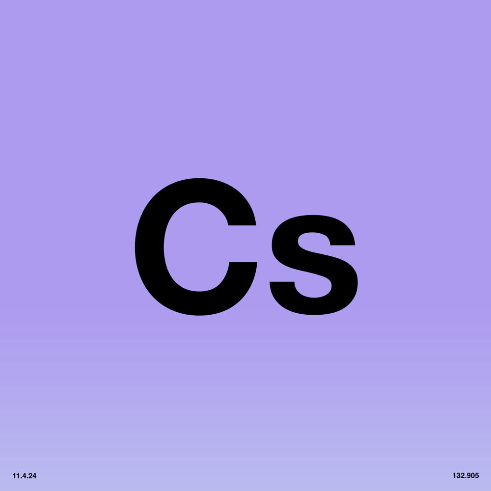
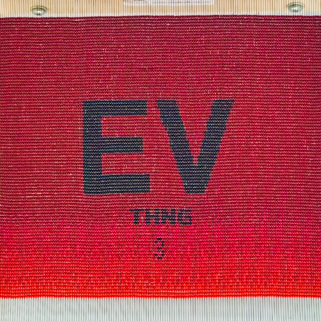

# Everything is Free

[](https://www.npmjs.com/package/@ichbinsoftware/everything-is-free)
[](http://creativecommons.org/publicdomain/zero/1.0/)
[](https://ev3.ichbinsoftware.com)
[](https://ev3.ichbinsoftware.com)


<div align="center">
  
  <br/>
</div>  

An open, zero-restriction release of **Software-Entwicklungskit’s** album [Everything is Free](https://software-entwicklungskit.bandcamp.com/album/everything-is-free).

All audio stems, artwork, lyrics, and information in this repository are released under **Creative Commons Zero v1.0 Universal (CC0 1.0)**.

> **"This work is not a product. It is not content. It is not owned."**
>
> **"Music should circulate like electricity."**
>
> **"If something meaningful comes from this, it will not be because it was protected. It will be because it was free."**


## 🎵 Tracks

<br>

| # | Track | Symbol | BPM | Key | Stems | Links |
|:---|:---|:---:|:---:|:---:|:---:|:---|
| 1 | Hydrogen |  | 132 | D Major | 12 | [Interactive](https://ev3.ichbinsoftware.com/hydrogen) • [Mixer](https://evr.ichbinsoftware.com/hydrogen) • [Visualizer](https://evz.ichbinsoftware.com/hydrogen) • [Source](src/1.Hydrogen) |
| 2 | Lithium |  | 124 | G minor | 38 | [Interactive](https://ev3.ichbinsoftware.com/lithium) • [Mixer](https://evr.ichbinsoftware.com/lithium) • [Visualizer](https://evz.ichbinsoftware.com/lithium) • [Source](src/2.Lithium) |
| 3 | Sodium |  | 140 | G minor | 28 | [Interactive](https://ev3.ichbinsoftware.com/sodium) • [Mixer](https://evr.ichbinsoftware.com/sodium) • [Visualizer](https://evz.ichbinsoftware.com/sodium) • [Source](src/3.Sodium) |
| 4 | Potassium |  | 90 | C Major | 19 | [Interactive](https://ev3.ichbinsoftware.com/potassium) • [Mixer](https://evr.ichbinsoftware.com/potassium) • [Visualizer](https://evz.ichbinsoftware.com/potassium) • [Source](src/4.Potassium) |
| 5 | Rubidium |  | 132 | G Major | 9 | [Interactive](https://ev3.ichbinsoftware.com/rubidium) • [Mixer](https://evr.ichbinsoftware.com/rubidium) • [Visualizer](https://evz.ichbinsoftware.com/rubidium) • [Source](src/5.Rubidium) |
| 6 | Caesium |  | 130 | C Major | 16 | [Interactive](https://ev3.ichbinsoftware.com/caesium) • [Mixer](https://evr.ichbinsoftware.com/caesium) • [Visualizer](https://evz.ichbinsoftware.com/caesium) • [Source](src/6.Caesium) |
| 7 | Francium |  | 128 | B flat | 26 | [Interactive](https://ev3.ichbinsoftware.com/francium) • [Mixer](https://evr.ichbinsoftware.com/francium) • [Visualizer](https://evz.ichbinsoftware.com/francium) • [Source](src/7.Francium) |


## 🎨 Artwork

Digital artwork by **Maubere**.

Bead work by **Beadhammer**.

### Main  


### Beadwork  


## 🤝 Contributing

Contributions are welcome! Please feel free to submit a Pull Request.

1. Fork the repository
2. Create your feature branch (`git checkout -b feature/awesome-feature`)
3. Commit your changes (`git commit -m 'Add awesome feature'`)
4. Push to the branch (`git push origin feature/awesome-feature`)
5. Open a Pull Request

## 🎯 Usage

### 🎛️ For Producers and Musicians

1.  **Download:** Clone repository or **Download** uncompressed WAV stems [Here](https://ev3.ichbinsoftware.com).
2.  **Sync:** All stems begin at **Bar 1**.
3.  **Tempo:** Set your DAW to **BPM** of track.
4.  **Import:** Drag & drop into Ableton, Logic, FL Studio, Reaper, Bitwig, etc. Stems will align automatically.


### 📦 For Developers

Install the npm package to access album metadata, track information, and stem data programmatically:

```bash
npm install @ichbinsoftware/everything-is-free
```

#### Node.js Usage

```javascript
// CommonJS
const ev3 = require('@ichbinsoftware/everything-is-free');

// Or ES6 modules
import ev3 from '@ichbinsoftware/everything-is-free';

// Access album metadata
console.log(`${ev3.album} by ${ev3.artist}`);
console.log(`Released: ${ev3.released}`);
console.log(`License: ${ev3.license}`);
console.log(`Homepage: ${ev3.homePage}`);

// Print the manifesto
console.log(ev3.manifesto);

// Access track information
const hydrogen = ev3.tracks[0];
console.log(`${hydrogen.title} - ${hydrogen.bpm} BPM in ${hydrogen.key}`);
console.log(`Symbol: ${hydrogen.symbol} | Color: ${hydrogen.color}`);
console.log(`Stems: ${hydrogen.stems.length}`);
```

#### Browser Usage

```html
<!-- Using ES6 modules with unpkg CDN -->
<script type="module">
  import ev3 from 'https://unpkg.com/@ichbinsoftware/everything-is-free';

  console.log(ev3.manifesto);

  const track = ev3.tracks[0];
  console.log(`${track.title} - ${track.bpm} BPM`);
</script>
```

Or use a bundler (webpack, vite, parcel) to import the package in your browser application:

```javascript
import ev3 from '@ichbinsoftware/everything-is-free';

// Your browser code here
const track = ev3.tracks[0];
const audio = new Audio(track.streamUrl);
audio.play();
```

#### NPM Scripts

```bash
npm run manifesto  # Print the album manifesto
npm run info       # Display album metadata
```

#### Working with Stems

```javascript
const lithium = ev3.tracks[1]; // Lithium (2nd track)
console.log(`\n${lithium.title} has ${lithium.stems.length} stems:\n`);

// List all stems with descriptions
lithium.stems.forEach((stem, index) => {
  console.log(`${index + 1}. ${stem.name}`);
  console.log(`   Description: ${stem.description}`);
  console.log(`   Stream (M4A): ${stem.streamUrl}`);
  console.log(`   Download (WAV): ${stem.wavUrl}\n`);
});

// Find specific stems by keyword
const drumStems = lithium.stems.filter(s =>
  s.description.toLowerCase().includes('drum')
);
console.log(`Found ${drumStems.length} drum stems`);

// Download stems programmatically
lithium.stems.forEach(stem => {
  // Use stem.wavUrl for production-quality WAV files (24-bit, 44.1kHz)
  // Use stem.streamUrl for compressed M4A files (faster streaming)
  console.log(`Downloading: ${stem.wavUrl}`);
});
```

#### Audio Playback Example (Browser)

```html
<script type="module">
  import ev3 from 'https://unpkg.com/@ichbinsoftware/everything-is-free';

  const track = ev3.tracks[0];
  console.log(`Now Playing: ${track.title} (${track.bpm} BPM)`);

  // Play master track (M4A)
  const audio = new Audio(track.streamUrl);
  audio.play();

  // Play individual stems
  const voxLead = track.stems.find(s => s.name.includes('VOX LEAD'));
  const stemAudio = new Audio(voxLead.streamUrl);
  stemAudio.play();
</script>
```

#### Accessing Artwork & Lyrics

```javascript
const sodium = ev3.tracks[2]; // Sodium

// Artwork URLs (PNG format)
console.log(`Gradient: ${sodium.gradientImageUrl}`);
console.log(`Symbol: ${sodium.symbolImageUrl}`);
console.log(`Text: ${sodium.textImageUrl}`);

// Track URLs
console.log(`Web Player: ${sodium.webUrl}`);
console.log(`ZIP Download: ${sodium.stemsUrl}`);
console.log(`GitHub Source: ${sodium.repoSource}`);

// Lyrics (if available)
if (sodium.lyrics) {
  console.log(`\nLyrics:\n${sodium.lyrics}`);
}
```

#### Data Structure Reference

**Package exports:**
- `artist` (String) - Artist name
- `album` (String) - Album title
- `released` (String) - Release date
- `albumPage` (String) - Bandcamp URL
- `homePage` (String) - Web interface URL
- `license` (String) - License information
- `manifesto` (String) - Full manifesto text
- `tracks` (Array) - Array of track objects

**Each track object contains:**
- `title`, `number`, `symbol`, `color` - Basic metadata
- `bpm`, `key` - Musical properties
- `streamUrl`, `wavUrl`, `stemsUrl` - Audio URLs
- `gradientImageUrl`, `symbolImageUrl`, `textImageUrl` - Artwork URLs
- `webUrl`, `repoSource` - Web links
- `lyrics` (String, optional) - Song lyrics
- `stems` (Array) - Array of stem objects

**Each stem object contains:**
- `name` (String) - Stem filename without extension
- `description` (String) - Human-readable description
- `streamUrl` (String) - M4A file URL for streaming
- `wavUrl` (String) - WAV file URL for download


## 📜 Manifesto

This work is not a product.
It is not content.
It is not owned.

Everything here passed through physical machines: computers, samplers, circuits, voltage, human decisions.

Everything here is released without restriction.

You may:
- copy it
- remix it
- destroy it
- commercialise it
- repackage it
- ignore it

You do not need to ask.
You do not need to credit.
You do not need permission.

If you are looking for scarcity, this is not for you.
If you are looking for control, this is not for you.

This album exists as:
- raw material
- public infrastructure
- a shared resource
- an invitation

Music should not be locked behind platforms, licenses, or someone else's taste.
Music should circulate like electricity.

If something meaningful comes from this,
it will not be because it was protected.

It will be because it was free.

—
**Software-Entwicklungskit**


## ⚖️ License

This work is dedicated to the public domain under  
**Creative Commons Zero v1.0 Universal (CC0 1.0)**.

You may copy, modify, distribute, perform, remix, sample, or commercialize this work  
**without permission, credit, or restriction**.


## 👥 Credits
- **Music & Production:** Software-Entwicklungskit | [@ichbinsoftware](https://www.instagram.com/ichbinsoftware/)
- **Artwork:** Maubere  
- **Beadwork:** Beadhammer | [@beadhammer](https://www.instagram.com/beadhammer/)

## 🔗 Related

- [everythingisremixed](https://github.com/ichbinsoftware/everythingisremixed) — Online remixer, effects bus and online sharing
- [everythingisvisualized](https://github.com/ichbinsoftware/everythingisvisualized) — 3D music visualizer