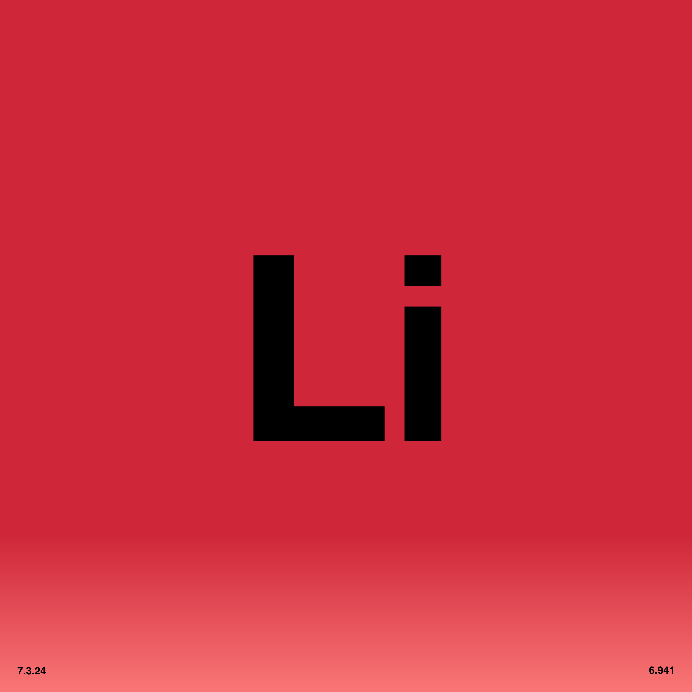

# 2. Lithium

<div align="center">
  
  <br><br>

  [](http://creativecommons.org/publicdomain/zero/1.0/)
  [](#track-information)
  [](#track-information)
  [](#technical-specifications)

</div>

An open, zero-restriction audio release of **"Lithium"**, from **Software-Entwicklungskit's** album [Everything is Free](https://software-entwicklungskit.bandcamp.com/album/everything-is-free).

All audio stems, artwork, lyrics, and information in this directory are released under **Creative Commons Zero v1.0 Universal (CC0 1.0)** — meaning:

> **You may use, remix, transform, sample, commercialize, or redistribute these files with absolutely no restrictions and no attribution required.**


## 🎵 Track Information

| Track | BPM | Key | Audio |
|:---|:---|:---|:---|
| **Lithium** | **124** | **G minor** | [▶️ Play](https://lithium.ichbinsoftware.com/2.Lithium_Master.m4a) |

## 📂 Audio Contents

**Total:** 39 audio files (including master track)
**Size:** ~3.44 GB (3,519 MB)

### 🔊 Download
* **All uncompressed stems + Master:** [▶️ Play & Download](https://ev3.ichbinsoftware.com/lithium)
* **All uncompressed stems + Master (ZIP):** [⬇️ Download](https://lithium.ichbinsoftware.com/2.Lithium_STEMS.zip)

### Audio Stems (WAV)

| # | Filename | Size | Description |
|:---|:---|:---|:---|
| 1 | `2.Lithium_Master.wav` | 91.3 MB | Full mix master track |
| 2 | `2.Lithium_Stem_ALT HH.wav` | 94.7 MB | Alternate hi-hat pattern |
| 3 | `2.Lithium_Stem_ARP DIST.wav` | 94.7 MB | Distorted arpeggiator |
| 4 | `2.Lithium_Stem_BEEP.wav` | 94.7 MB | Beep sound effect |
| 5 | `2.Lithium_Stem_BGVOX 1.wav` | 94.7 MB | Background vocals 1 |
| 6 | `2.Lithium_Stem_BGVOX 2.wav` | 94.7 MB | Background vocals 2 |
| 7 | `2.Lithium_Stem_BGVOX 3.wav` | 94.7 MB | Background vocals 3 |
| 8 | `2.Lithium_Stem_BGVOX AAAAAHHHH.wav` | 94.7 MB | Background vocals extended "ahhh" |
| 9 | `2.Lithium_Stem_BGVOX HARMONY GLITCH.wav` | 94.7 MB | Background vocals harmony with glitch effect |
| 10 | `2.Lithium_Stem_BGVOX ICK ICK.wav` | 94.7 MB | Background vocals "ick ick" sample |
| 11 | `2.Lithium_Stem_BGVOX MAIN.wav` | 94.7 MB | Main background vocals |
| 12 | `2.Lithium_Stem_BGVOX REVERSE.wav` | 94.7 MB | Background vocals reverse effect |
| 13 | `2.Lithium_Stem_BREAK BEAT.wav` | 94.7 MB | Breakbeat drum pattern |
| 14 | `2.Lithium_Stem_CRASH FADE.wav` | 94.7 MB | Crash cymbal fade |
| 15 | `2.Lithium_Stem_CRASH INTRO.wav` | 94.7 MB | Crash cymbal intro |
| 16 | `2.Lithium_Stem_CRUSH BREAK.wav` | 94.7 MB | Bit-crush break effect |
| 17 | `2.Lithium_Stem_ECHO PAD.wav` | 94.7 MB | Echo pad texture |
| 18 | `2.Lithium_Stem_EDM BUILD.wav` | 94.7 MB | EDM build-up/riser |
| 19 | `2.Lithium_Stem_FILL PIANO.wav` | 94.7 MB | Piano fill/accent |
| 20 | `2.Lithium_Stem_GLITCH HH.wav` | 94.7 MB | Glitchy hi-hat |
| 21 | `2.Lithium_Stem_HAT FILL.wav` | 94.7 MB | Hi-hat fill |
| 22 | `2.Lithium_Stem_HATS.wav` | 94.7 MB | Main hi-hats |
| 23 | `2.Lithium_Stem_HH GLITCH.wav` | 94.7 MB | Hi-hat glitch effect |
| 24 | `2.Lithium_Stem_HOUSE BEAT.wav` | 94.7 MB | House beat pattern |
| 25 | `2.Lithium_Stem_INTRO DRUMS.wav` | 94.7 MB | Intro drum pattern |
| 26 | `2.Lithium_Stem_KICK.wav` | 94.7 MB | Main kick drum |
| 27 | `2.Lithium_Stem_MELODY PAD.wav` | 94.7 MB | Melodic pad |
| 28 | `2.Lithium_Stem_MINILOGUE_SYNTH.wav` | 94.7 MB | Minilogue synthesizer |
| 29 | `2.Lithium_Stem_OFF KICK.wav` | 94.7 MB | Off-beat kick drum |
| 30 | `2.Lithium_Stem_ORGAN SWEEP EFFECT.wav` | 94.7 MB | Organ sweep effect |
| 31 | `2.Lithium_Stem_PAD INTRO.wav` | 94.7 MB | Pad intro/atmosphere |
| 32 | `2.Lithium_Stem_PLUCK.wav` | 94.7 MB | Plucked synth |
| 33 | `2.Lithium_Stem_SLOW BEAT.wav` | 94.7 MB | Slow/half-time beat pattern |
| 34 | `2.Lithium_Stem_SNARE BUILD.wav` | 94.7 MB | Snare build-up/roll |
| 35 | `2.Lithium_Stem_SY BASS.wav` | 94.7 MB | Synthesizer bass |
| 36 | `2.Lithium_Stem_TOM BREAK.wav` | 94.7 MB | Tom drum break pattern |
| 37 | `2.Lithium_Stem_TOMS.wav` | 94.7 MB | Tom drums |
| 38 | `2.Lithium_Stem_VOX ECHO.wav` | 94.7 MB | Vocals with echo effect |
| 39 | `2.Lithium_Stem_VOX LEAD.wav` | 94.7 MB | Lead vocals |

## 🎛 Technical Specifications

* **File Format:** WAV (Waveform Audio File Format)
* **Bit Depth:** 24-bit (Uncompressed)
* **File Size:** ~94.7 MB per stem
* **Total Size:** ~3.44 GB

## 🎹 Stem Categories

The stems are organized into the following categories:

* **Lead Vocals:** `VOX LEAD`, `VOX ECHO`
* **Background Vocals:** `BGVOX 1`, `BGVOX 2`, `BGVOX 3`, `BGVOX AAAAAHHHH`, `BGVOX HARMONY GLITCH`, `BGVOX ICK ICK`, `BGVOX MAIN`, `BGVOX REVERSE`
* **Drums/Percussion:**
  * Kicks: `KICK`, `OFF KICK`
  * Snares: `SNARE BUILD`
  * Hi-Hats: `ALT HH`, `GLITCH HH`, `HAT FILL`, `HATS`, `HH GLITCH`
  * Toms: `TOM BREAK`, `TOMS`
  * Cymbals: `CRASH FADE`, `CRASH INTRO`
  * Patterns: `BREAK BEAT`, `HOUSE BEAT`, `INTRO DRUMS`, `SLOW BEAT`
* **Bass:** `SY BASS`
* **Melodic/Harmonic:**
  * Synths: `ARP DIST`, `MINILOGUE_SYNTH`, `PLUCK`
  * Keys: `FILL PIANO`, `ORGAN SWEEP EFFECT`
  * Pads: `ECHO PAD`, `MELODY PAD`, `PAD INTRO`
* **FX/Atmosphere:** `BEEP`, `CRUSH BREAK`, `EDM BUILD`

## 🎯 How to Use These Stems

1.  **Sync:** All stems begin at **Bar 1**.
2.  **Tempo:** Set your DAW to **124 BPM**.
3.  **Import:** Drag & drop into Ableton, Logic, FL Studio, Reaper, Bitwig, etc. Stems will align automatically.


## 📝 Lyrics
```
Music, to me, is the most beautiful form
Music, to me, is the most beautiful form

The most beautiful form
The most beautiful form

Music, to me, is the most beautiful form
It moves by you in its own rhythm
It gives you its own time frame
It gives you its own time frame
It moves by you in its own rhythm
It's not like reading a book or looking at a painting.
Music to me is the biggest inspiration

Art is not a mirror held up to reality
but a hammer with which to shape it.
```


## 🎨 Artwork

All artwork by **Maubere**.

### Main


### Symbol


### Text


## ⚖️ License

This work is dedicated to the public domain under
**Creative Commons Zero v1.0 Universal (CC0 1.0)**.

You may copy, modify, distribute, perform, remix, sample, or commercialize this work
**without permission, credit, or restriction**.


## 👥 Credits
- **Music & Production:** Software-Entwicklungskit
- **Artwork:** Maubere

```
****************************************************************************************************
****************************************************************************************************
****************************************************************************************************
****************************************************************************************************
****************************************************************************************************
****************************************************************************************************
****************************************************************************************************
****************************************************************************************************
****************************************************************************************************
****************************************************************************************************
****************************************************************************************************
****************************************************************************************************
****************************************************************************************************
****************************************************************************************************
****************************************************************************************************
****************************************************************************************************
****************************************************************************************************
****************************************************************************************************
****************************************************************************************************
****************************************************************************************************
************************************#@@@@@%***************%@@@@%************************************
************************************#@@@@@%***************%@@@@@************************************
************************************#@@@@@%***************%@@@@%************************************
************************************#@@@@@%*********************************************************
************************************#@@@@@%***************%%%%%%************************************
************************************#@@@@@%***************%@@@@@************************************
************************************#@@@@@%***************%@@@@@************************************
************************************#@@@@@%***************%@@@@@************************************
************************************#@@@@@%***************%@@@@@************************************
************************************#@@@@@%***************%@@@@@************************************
************************************#@@@@@%***************%@@@@@************************************
************************************#@@@@@%***************%@@@@@************************************
************************************#@@@@@@@@@@@@@@@@@@%**%@@@@@************************************
************************************#@@@@@@@@@@@@@@@@@@%**%@@@@@************************************
************************************#@@@@@@@@@@@@@@@@@@%**%@@@@@************************************
****************************************************************************************************
****************************************************************************************************
****************************************************************************************************
****************************************************************************************************
****************************************************************************************************
****************************************************************************************************
****************************************************************************************************
****************************************************************************************************
****************************************************************************************************
****************************************************************************************************
****************************************************************************************************
****************************************************************************************************
++++++++++++++++++++++++++++++++++++++++++++++++++++++++++++++++++++++++++++++++++++++++++++++++++++
++++++++++++++++++++++++++++++++++++++++++++++++++++++++++++++++++++++++++++++++++++++++++++++++++++
++++++++++++++++++++++++++++++++++++++++++++++++++++++++++++++++++++++++++++++++++++++++++++++++++++
++++++++++++++++++++++++++++++++++++++++++++++++++++++++++++++++++++++++++++++++++++++++++++++++++++
++++++++++++++++++++++++++++++++++++++++++++++++++++++++++++++++++++++++++++++++++++++++++++++++++++
====================================================================================================
==++**+======================================================================================+***+==
====================================================================================================
```