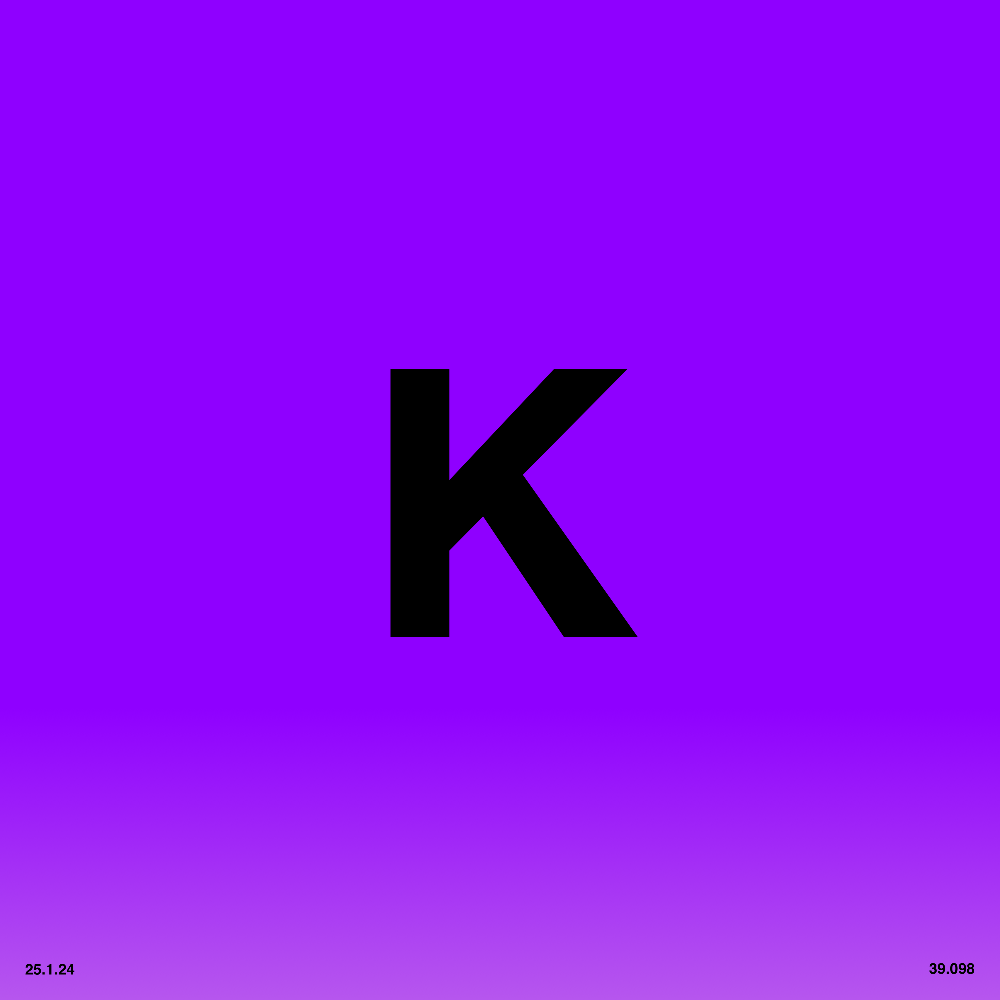
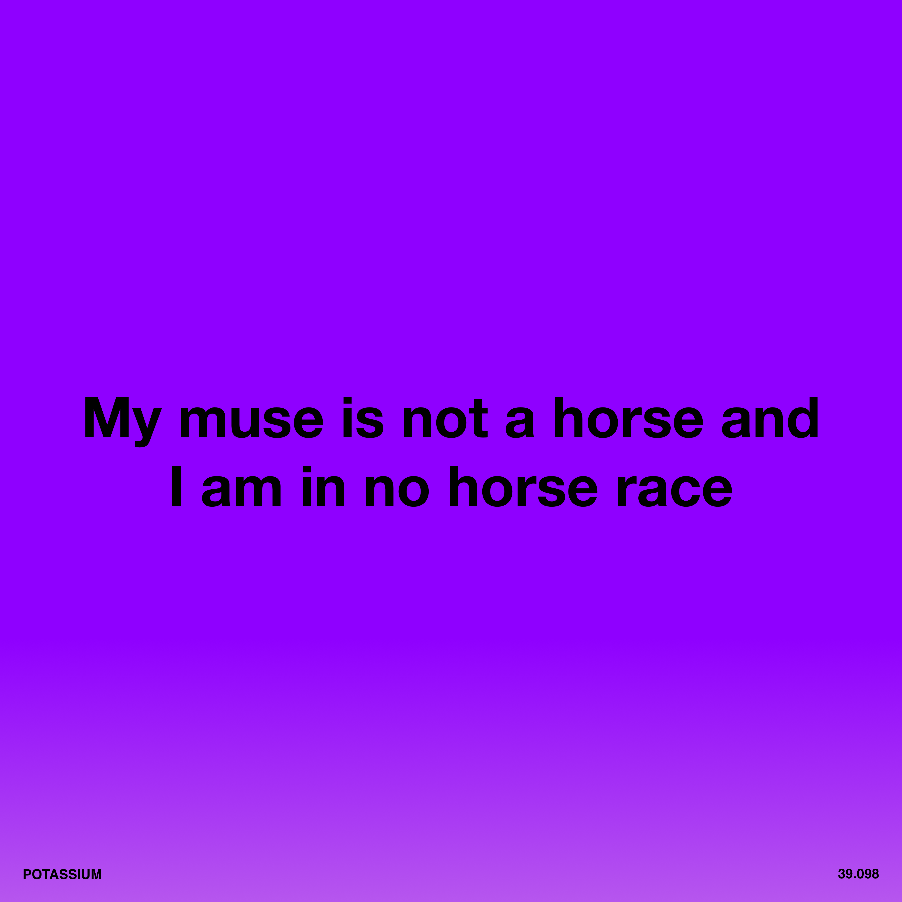

# 4. Potassium

<div align="center">
  
  <br><br>

  [](http://creativecommons.org/publicdomain/zero/1.0/)
  [](#track-information)
  [](#track-information)
  [](#technical-specifications)

</div>

An open, zero-restriction audio release of **"Potassium"**, from **Software-Entwicklungskit's** album [Everything is Free](https://software-entwicklungskit.bandcamp.com/album/everything-is-free).

All audio stems, artwork, lyrics, and information in this directory are released under **Creative Commons Zero v1.0 Universal (CC0 1.0)** — meaning:

> **You may use, remix, transform, sample, commercialize, or redistribute these files with absolutely no restrictions and no attribution required.**

---

## 🎵 Track Information

| Track | BPM | Key | Audio |
|:---|:---|:---|:---|
| **Potassium** | **90** | **C Major** | [▶️ Play](https://potassium.ichbinsoftware.com/4.Potassium_Master.m4a) |

## 📂 Audio Contents

**Total:** 20 audio files (including master track)
**Size:** ~1.35 GB (1,378 MB)

### 🔊 Download
* **All stems + Master:** [▶️ Play & Download](https://ev3.ichbinsoftware.com/potassium)
* **All stems + Master (ZIP):** [⬇️ Download](https://potassium.ichbinsoftware.com/4.Potassium_STEMS.zip)

### Audio Stems (WAV)

| # | Filename | Size | Description |
|:---|:---|:---|:---|
| 1 | `4.Potassium_Master.wav` | 70.9 MB | Full mix master track |
| 2 | `4.Potassium_Stem_BGVOX ALT.wav` | 72.3 MB | Alternate background vocals |
| 3 | `4.Potassium_Stem_BGVOX ECHO.wav` | 72.3 MB | Background vocals with echo effect |
| 4 | `4.Potassium_Stem_BREAKBEAT.wav` | 72.3 MB | Breakbeat drum pattern |
| 5 | `4.Potassium_Stem_BUILD.wav` | 72.3 MB | Build-up/riser section |
| 6 | `4.Potassium_Stem_END DRUMS.wav` | 72.3 MB | Ending drum pattern |
| 7 | `4.Potassium_Stem_HAT FILL.wav` | 72.3 MB | Hi-hat fill |
| 8 | `4.Potassium_Stem_HATS.wav` | 72.3 MB | Main hi-hats |
| 9 | `4.Potassium_Stem_KEYS.wav` | 72.3 MB | Keyboard/piano |
| 10 | `4.Potassium_Stem_KICK HATS.wav` | 72.3 MB | Kick drum with hi-hats |
| 11 | `4.Potassium_Stem_KICK.wav` | 72.3 MB | Main kick drum |
| 12 | `4.Potassium_Stem_MALLET.wav` | 72.3 MB | Mallet percussion |
| 13 | `4.Potassium_Stem_MICROCOSM_EFFECT.wav` | 72.3 MB | Microcosm granular effect |
| 14 | `4.Potassium_Stem_MINILOGUE_SYNTH.wav` | 72.3 MB | Minilogue synthesizer |
| 15 | `4.Potassium_Stem_OUTRO DRUM.wav` | 72.3 MB | Outro drum pattern |
| 16 | `4.Potassium_Stem_PAD + BASS.wav` | 72.3 MB | Pad and bass combined |
| 17 | `4.Potassium_Stem_SNARE.wav` | 72.3 MB | Snare drum |
| 18 | `4.Potassium_Stem_SWEEP.wav` | 72.3 MB | Sweep/filter sweep effect |
| 19 | `4.Potassium_Stem_TRAP BEAT.wav` | 72.3 MB | Trap-style beat pattern |
| 20 | `4.Potassium_Stem_VOX LEAD.wav` | 72.3 MB | Lead vocals |

---

## 🎛 Technical Specifications

* **File Format:** WAV (Waveform Audio File Format)
* **Bit Depth:** 24-bit (Uncompressed)
* **File Size:** ~72.3 MB per stem
* **Total Size:** ~1.35 GB

## 🎹 Stem Categories

The stems are organized into the following categories:

* **Lead Vocals:** `VOX LEAD`
* **Background Vocals:** `BGVOX ALT`, `BGVOX ECHO`
* **Drums/Percussion:**
  * Kicks: `KICK`, `KICK HATS`
  * Snares: `SNARE`
  * Hi-Hats: `HAT FILL`, `HATS`, `KICK HATS`
  * Patterns: `BREAKBEAT`, `END DRUMS`, `OUTRO DRUM`, `TRAP BEAT`
  * Mallet: `MALLET`
* **Bass/Pads:** `PAD + BASS`
* **Melodic/Harmonic:**
  * Keys: `KEYS`
  * Synths: `MINILOGUE_SYNTH`
* **FX/Atmosphere:** `BUILD`, `MICROCOSM_EFFECT`, `SWEEP`

## 🚀 How to Use These Stems

1.  **Sync:** All stems begin at **Bar 1**.
2.  **Tempo:** Set your DAW to **90 BPM**.
3.  **Import:** Drag & drop into Ableton, Logic, FL Studio, Reaper, Bitwig, etc. Stems will align automatically.

---

## 📝 Lyrics
```
My relationship with my muse is a delicate one
My relationship with my muse is a delicate one

She comes to me with the gift of song
She comes to me with the gift of song
She comes to me with the gift of song
She comes to me with the gift of song

And in return I treat her with the respect I feel she deserves
And in return I treat her with the respect I feel she deserves

My muse is not a horse and I am in no horse race
My muse is not a horse and I am in no horse race

And if indeed she was, still I would not harness her to this tumbrel
And if indeed she was, still I would not harness her to this tumbrel

My muse may spook
May bolt
May abandon me completely
```


## 🎨 Artwork

All artwork by **Maubere**.

### Main


### Symbol


### Text


---

## ⚖️ License

This work is dedicated to the public domain under
**Creative Commons Zero v1.0 Universal (CC0 1.0)**.

You may copy, modify, distribute, perform, remix, sample, or commercialize this work
**without permission, credit, or restriction**.

---

## 👥 Credits
- **Music & Production:** Software-Entwicklungskit
- **Artwork:** Maubere

```
####################################################################################################
####################################################################################################
####################################################################################################
####################################################################################################
####################################################################################################
####################################################################################################
####################################################################################################
####################################################################################################
####################################################################################################
####################################################################################################
####################################################################################################
####################################################################################################
####################################################################################################
####################################################################################################
####################################################################################################
####################################################################################################
####################################################################################################
####################################################################################################
####################################################################################################
####################################################################################################
#######################################@@@@@@##########@@@@@@@%#####################################
#######################################@@@@@@########%@@@@@@@#######################################
#######################################@@@@@@######%@@@@@@@#########################################
#######################################@@@@@@####%@@@@@@@%##########################################
#######################################@@@@@@###@@@@@@@%############################################
#######################################@@@@@@#%@@@@@@%##############################################
#######################################@@@@@@@@@@@@@@###############################################
#######################################@@@@@@@@@@@@@@@%#############################################
#######################################@@@@@@@@@@@@@@@@%############################################
#######################################@@@@@@@%##%@@@@@@@###########################################
#######################################@@@@@@#####%@@@@@@@##########################################
#######################################@@@@@@#######@@@@@@@%########################################
#######################################@@@@@@########@@@@@@@%#######################################
#######################################@@@@@@#########%@@@@@@@######################################
#######################################@@@@@@##########%@@@@@@@#####################################
####################################################################################################
####################################################################################################
####################################################################################################
####################################################################################################
####################################################################################################
####################################################################################################
####################################################################################################
####################################################################################################
****************************************************************************************************
****************************************************************************************************
****************************************************************************************************
****************************************************************************************************
****************************************************************************************************
****************************************************************************************************
****************************************************************************************************
****************************************************************************************************
++++++++++++++++++++++++++++++++++++++++++++++++++++++++++++++++++++++++++++++++++++++++++++++++++++
++++++++++++++++++++++++++++++++++++++++++++++++++++++++++++++++++++++++++++++++++++++++++++++++++++
++*#**#*+++++++++++++++++++++++++++++++++++++++++++++++++++++++++++++++++++++++++++++++++++++#**#*++
++++++++++++++++++++++++++++++++++++++++++++++++++++++++++++++++++++++++++++++++++++++++++++++++++++
```