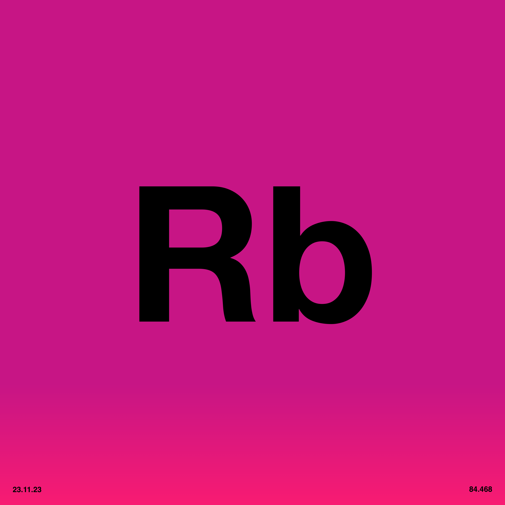
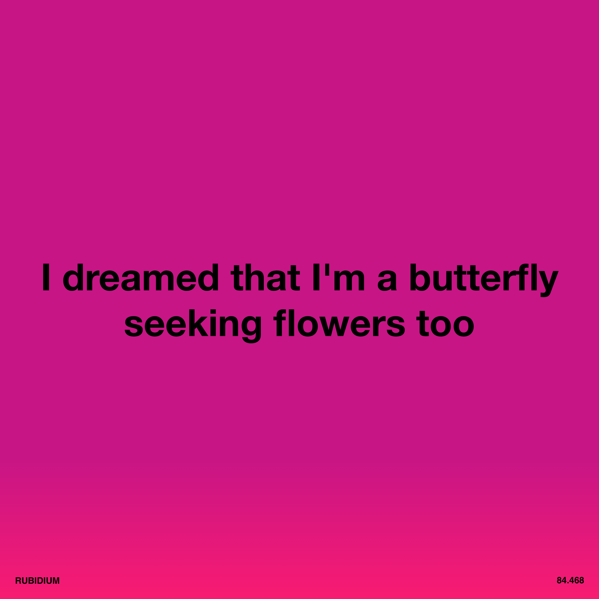

# 5. Rubidium

<div align="center">
  
  <br><br>

  [](http://creativecommons.org/publicdomain/zero/1.0/)
  [](#track-information)
  [](#track-information)
  [](#technical-specifications)

</div>

An open, zero-restriction audio release of **"Rubidium"**, from **Software-Entwicklungskit's** album [Everything is Free](https://software-entwicklungskit.bandcamp.com/album/everything-is-free).

All audio stems, artwork, lyrics, and information in this directory are released under **Creative Commons Zero v1.0 Universal (CC0 1.0)** — meaning:

> **You may use, remix, transform, sample, commercialize, or redistribute these files with absolutely no restrictions and no attribution required.**


## 🎵 Track Information

| Track | BPM | Key | Stems | Audio |
|:---|:---|:---|:---|:---|
| **Rubidium** | **132** | **G Major** | **9** | [▶️ Play](https://rubidium.ichbinsoftware.com/5.Rubidium_Master.m4a) |

## 📂 Audio Contents

**Total:** 10 audio files (including master track)
**Size:** ~759 MB (0.74 GB)

### 🔊 Download
* **All uncompressed stems + Master:** [▶️ Play & Download](https://ev3.ichbinsoftware.com/rubidium)
* **All uncompressed stems + Master (ZIP):** [⬇️ Download](https://rubidium.ichbinsoftware.com/5.Rubidium_STEMS.zip)

### Audio Stems (WAV)

| # | Filename | Size | Description |
|:---|:---|:---|:---|
| 1 | `5.Rubidium_Master.wav` | 75.9 MB | Full mix master track |
| 2 | `5.Rubidium_Stem_BGVOX.wav` | 80.0 MB | Background vocals |
| 3 | `5.Rubidium_Stem_BUILD.wav` | 80.0 MB | Build-up/riser section |
| 4 | `5.Rubidium_Stem_DRUMS 2.wav` | 80.0 MB | Drum pattern 2 |
| 5 | `5.Rubidium_Stem_DRUMS MAIN.wav` | 80.0 MB | Main drum pattern |
| 6 | `5.Rubidium_Stem_DRUMS OUTRO.wav` | 80.0 MB | Outro drum pattern |
| 7 | `5.Rubidium_Stem_MELODY BREAK.wav` | 80.0 MB | Melodic break section |
| 8 | `5.Rubidium_Stem_MINILOGUE_SYNTH.wav` | 80.0 MB | Minilogue synthesizer |
| 9 | `5.Rubidium_Stem_PLUCK.wav` | 80.0 MB | Plucked synth |
| 10 | `5.Rubidium_Stem_VOX LEAD.wav` | 80.0 MB | Lead vocals |


## 🎛 Technical Specifications

* **File Format:** WAV (Waveform Audio File Format)
* **Bit Depth:** 24-bit (Uncompressed)
* **File Size:** ~80.0 MB per stem
* **Total Size:** ~759 MB

## 🎹 Stem Categories

The stems are organized into the following categories:

* **Lead Vocals:** `VOX LEAD`
* **Background Vocals:** `BGVOX`
* **Drums/Percussion:** `DRUMS 2`, `DRUMS MAIN`, `DRUMS OUTRO`
* **Melodic/Harmonic:**
  * Synths: `MINILOGUE_SYNTH`, `PLUCK`
  * Melodic Elements: `MELODY BREAK`
* **FX/Atmosphere:** `BUILD`

## 🎯 How to Use These Stems

1.  **Sync:** All stems begin at **Bar 1**.
2.  **Tempo:** Set your DAW to **132 BPM**.
3.  **Import:** Drag & drop into Ableton, Logic, FL Studio, Reaper, Bitwig, etc. Stems will align automatically.


## 📝 Lyrics
```
There's a messenger with letters in the rain
There's a broken heart by the window

There's a messenger with letters in the rain
There's a broken heart by the window

From dawn to dusk, I'm drunk and singing
lovesick with every new spring

From dawn to dusk, I'm drunk and singing
lovesick with every new spring

Ice melts in distance streams
I miss your clear voice

Ice melts in distance streams
I miss your clear voice

Drunk we sleep, awake we sing
quite aware of nothing

I dreamed that I'm a butterfly
seeking flowers too

I dreamed that I'm a butterfly
seeking flowers too
```


## 🎨 Artwork

All artwork by **Maubere**.

### Main


### Symbol


### Text



## ⚖️ License

This work is dedicated to the public domain under
**Creative Commons Zero v1.0 Universal (CC0 1.0)**.

You may copy, modify, distribute, perform, remix, sample, or commercialize this work
**without permission, credit, or restriction**.


## 👥 Credits
- **Music & Production:** Software-Entwicklungskit
- **Artwork:** Maubere

```
****************************************************************************************************
****************************************************************************************************
****************************************************************************************************
****************************************************************************************************
****************************************************************************************************
****************************************************************************************************
****************************************************************************************************
****************************************************************************************************
****************************************************************************************************
****************************************************************************************************
****************************************************************************************************
****************************************************************************************************
****************************************************************************************************
****************************************************************************************************
****************************************************************************************************
****************************************************************************************************
****************************************************************************************************
****************************************************************************************************
****************************************************************************************************
****************************************************************************************************
***************************%@@@@@@@@@@@@@@@@%##******#@@@@@#****************************************
***************************%@@@@@@@@@@@@@@@@@@@%#****#@@@@@%****************************************
***************************%@@@@@@@@@@@@@@@@@@@@@#***#@@@@@%****************************************
***************************%@@@@@%********#@@@@@@@#**#@@@@@%****************************************
***************************%@@@@@%*********#@@@@@@#**#@@@@@%##%@@@@@%##*****************************
***************************%@@@@@%*********#@@@@@%#**#@@@@@@@@@@@@@@@@@#****************************
***************************%@@@@@%*******#%@@@@@@#***#@@@@@@@@%##%@@@@@@%***************************
***************************%@@@@@@@@@@@@@@@@@@@%*****#@@@@@@#******%@@@@@#**************************
***************************%@@@@@@@@@@@@@@@@@@@#*****#@@@@@%********@@@@@%**************************
***************************%@@@@@%#######%@@@@@@@#***#@@@@@#********@@@@@%#*************************
***************************%@@@@@%********#@@@@@@%***#@@@@@#********@@@@@%**************************
***************************%@@@@@%*********#@@@@@%***#@@@@@@*******#@@@@@%**************************
***************************%@@@@@%**********@@@@@%***#@@@@@@@##**#%@@@@@@#**************************
***************************%@@@@@%**********@@@@@@#**#@@@@@@@@@@@@@@@@@%#***************************
***************************%@@@@@%**********%@@@@@#**#@@@@@#%@@@@@@@@@#*****************************
***************************************************************####*********************************
****************************************************************************************************
****************************************************************************************************
****************************************************************************************************
****************************************************************************************************
****************************************************************************************************
****************************************************************************************************
****************************************************************************************************
****************************************************************************************************
****************************************************************************************************
****************************************************************************************************
****************************************************************************************************
****************************************************************************************************
****************************************************************************************************
****************************************************************************************************
****************************************************************************************************
****************************************************************************************************
****************************************************************************************************
**##*###*************************************************************************************#####**
****************************************************************************************************
```