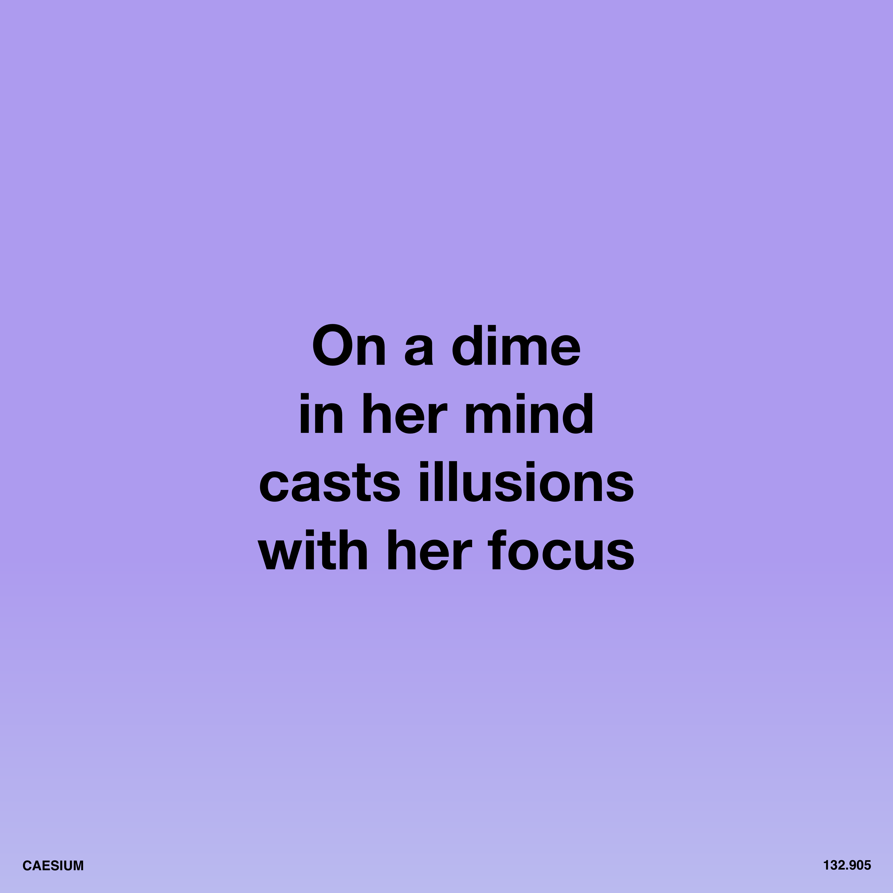

# 6. Caesium

<div align="center">
  
  <br><br>

  [](http://creativecommons.org/publicdomain/zero/1.0/)
  [](#track-information)
  [](#track-information)
  [](#technical-specifications)

</div>

An open, zero-restriction audio release of **"Caesium"**, from **Software-Entwicklungskit's** album [Everything is Free](https://software-entwicklungskit.bandcamp.com/album/everything-is-free).

All audio stems, artwork, lyrics, and information in this directory are released under **Creative Commons Zero v1.0 Universal (CC0 1.0)** — meaning:

> **You may use, remix, transform, sample, commercialize, or redistribute these files with absolutely no restrictions and no attribution required.**

---

## 🎵 Track Information

| Track | BPM | Key | Audio |
|:---|:---|:---|:---|
| **Caesium** | **130** | **C Major** | [▶️ Play](https://caesium.ichbinsoftware.com/6.Caesium_Master.m4a) |

## 📂 Audio Contents

**Total:** 17 audio files (including master track)
**Size:** ~1.08 GB (1,107 MB)

### 🔊 Download
* **All stems + Master:** [▶️ Play & Download](https://ev3.ichbinsoftware.com/caesium)
* **All stems + Master (ZIP):** [⬇️ Download](https://caesium.ichbinsoftware.com/6.Caesium_STEMS.zip)

### Audio Stems (WAV)

| # | Filename | Size | Description |
|:---|:---|:---|:---|
| 1 | `6.Caesium_Master.wav` | 65.7 MB | Full mix master track |
| 2 | `6.Caesium_Stem_ALT HATS.wav` | 68.4 MB | Alternate hi-hat pattern |
| 3 | `6.Caesium_Stem_BGVOX ALT.wav` | 68.4 MB | Alternate background vocals |
| 4 | `6.Caesium_Stem_BGVOX ECHO.wav` | 68.4 MB | Background vocals with echo effect |
| 5 | `6.Caesium_Stem_BGVOX HARMONY.wav` | 68.4 MB | Background vocals harmony/chord progression |
| 6 | `6.Caesium_Stem_BGVOX HIGH.wav` | 68.4 MB | Background vocals high frequency elements |
| 7 | `6.Caesium_Stem_BGVOX MAIN.wav` | 68.4 MB | Main background vocals |
| 8 | `6.Caesium_Stem_BREAK.wav` | 68.4 MB | Break/breakdown section |
| 9 | `6.Caesium_Stem_BUILD.wav` | 68.4 MB | Build-up/riser section |
| 10 | `6.Caesium_Stem_FILL SCRATCH.wav` | 68.4 MB | Fill with scratch effect |
| 11 | `6.Caesium_Stem_GARAGE BEAT.wav` | 68.4 MB | Garage-style beat pattern |
| 12 | `6.Caesium_Stem_HATS.wav` | 68.4 MB | Main hi-hats |
| 13 | `6.Caesium_Stem_KICK.wav` | 68.4 MB | Kick drum |
| 14 | `6.Caesium_Stem_MICROCOSM_EFFECT.wav` | 68.4 MB | Microcosm granular effect |
| 15 | `6.Caesium_Stem_MINILOGUE_SYNTH.wav` | 68.4 MB | Minilogue synthesizer |
| 16 | `6.Caesium_Stem_SCRATCH HATS.wav` | 68.4 MB | Scratch hi-hat sound effects |
| 17 | `6.Caesium_Stem_VOX LEAD.wav` | 68.4 MB | Lead vocals |

---

## 🎛 Technical Specifications

* **File Format:** WAV (Waveform Audio File Format)
* **Bit Depth:** 24-bit (Uncompressed)
* **File Size:** ~68.4 MB per stem
* **Total Size:** ~1.08 GB

## 🎹 Stem Categories

The stems are organized into the following categories:

* **Lead Vocals:** `VOX LEAD`
* **Background Vocals:** `BGVOX ALT`, `BGVOX ECHO`, `BGVOX HARMONY`, `BGVOX HIGH`, `BGVOX MAIN`
* **Drums/Percussion:**
  * Kicks: `KICK`
  * Hi-Hats: `ALT HATS`, `HATS`, `SCRATCH HATS`
  * Patterns: `BREAK`, `GARAGE BEAT`
  * Scratch: `FILL SCRATCH`
* **Melodic/Harmonic:**
  * Synths: `MINILOGUE_SYNTH`
* **FX/Atmosphere:** `BUILD`, `MICROCOSM_EFFECT`

## 🚀 How to Use These Stems

1.  **Sync:** All stems begin at **Bar 1**.
2.  **Tempo:** Set your DAW to **130 BPM**.
3.  **Import:** Drag & drop into Ableton, Logic, FL Studio, Reaper, Bitwig, etc. Stems will align automatically.

---

## 📝 Lyrics
```
She takes it and rolls it
But never ever smokes it

On a dime
with her mind
casts illusions
with her focus
```


## 🎨 Artwork

All artwork by **Maubere**.

### Main


### Symbol


### Text


---

## ⚖️ License

This work is dedicated to the public domain under
**Creative Commons Zero v1.0 Universal (CC0 1.0)**.

You may copy, modify, distribute, perform, remix, sample, or commercialize this work
**without permission, credit, or restriction**.

---

## 👥 Credits
- **Music & Production:** Software-Entwicklungskit
- **Artwork:** Maubere

```
====================================================================================================
====================================================================================================
====================================================================================================
====================================================================================================
====================================================================================================
====================================================================================================
====================================================================================================
====================================================================================================
====================================================================================================
====================================================================================================
====================================================================================================
====================================================================================================
====================================================================================================
====================================================================================================
====================================================================================================
====================================================================================================
====================================================================================================
====================================================================================================
====================================================================================================
====================================================================================================
===================================#@@@@@@@@@#+=====================================================
================================#@@@@@@@@@@@@@@@#===================================================
==============================#@@@@@@@@%%%@@@@@@@@*=================================================
=============================#@@@@@@+=======*@@@@@@+================================================
============================*@@@@@#==========+%@@@@@======+#@@@@@@@%*===============================
============================@@@@@%=============+++++====*@@@@@@@@@@@@@%=============================
===========================*@@@@@#=====================*@@@@@+===+#@@@@@============================
===========================#@@@@@*=====================%@@@@@======*****+===========================
===========================#@@@@@*=====================+@@@@@@@@%*++================================
===========================+@@@@@%============+#####+====#@@@@@@@@@@@@#+============================
============================%@@@@@*===========%@@@@@=========+*#@@@@@@@@#===========================
=============================@@@@@@#=========#@@@@@*===+++++=======%@@@@@===========================
=============================+%@@@@@@%*+++*%@@@@@@#====@@@@@#======%@@@@%===========================
===============================*@@@@@@@@@@@@@@@@@+======@@@@@@%%%%@@@@@%============================
=================================+%@@@@@@@@@@@%+=========+%@@@@@@@@@@%+=============================
-------------------------------------==++++=-----------------==++==---------------------------------
----------------------------------------------------------------------------------------------------
----------------------------------------------------------------------------------------------------
----------------------------------------------------------------------------------------------------
----------------------------------------------------------------------------------------------------
----------------------------------------------------------------------------------------------------
----------------------------------------------------------------------------------------------------
----------------------------------------------------------------------------------------------------
----------------------------------------------------------------------------------------------------
----------------------------------------------------------------------------------------------------
----------------------------------------------------------------------------------------------------
----------------------------------------------------------------------------------------------------
----------------------------------------------------------------------------------------------------
----------------------------------------------------------------------------------------------------
----------------------------------------------------------------------------------------------------
----------------------------------------------------------------------------------------------------
----------------------------------------------------------------------------------------------------
----------------------------------------------------------------------------------------------------
--===++=------------------------------------------------------------------------------------=+=++=--
----------------------------------------------------------------------------------------------------
```