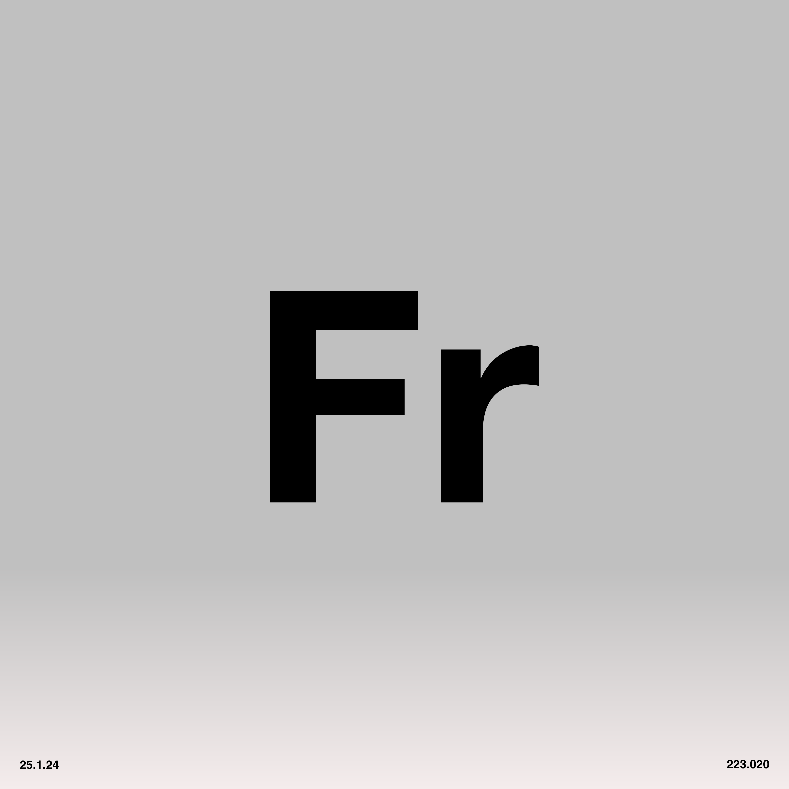
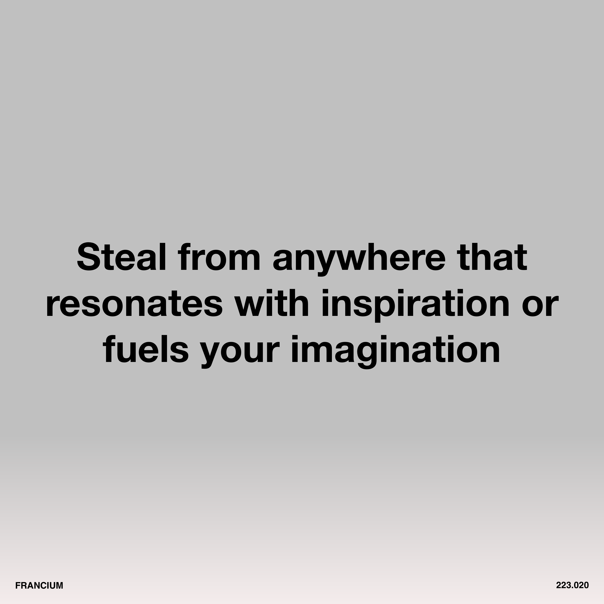

# 7. Francium

<div align="center">
  
  <br><br>

  [](http://creativecommons.org/publicdomain/zero/1.0/)
  [](#track-information)
  [](#track-information)
  [](#technical-specifications)

</div>

An open, zero-restriction audio release of **"Francium"**, from **Software-Entwicklungskit's** album [Everything is Free](https://software-entwicklungskit.bandcamp.com/album/everything-is-free).

All audio stems, artwork, lyrics, and information in this directory are released under **Creative Commons Zero v1.0 Universal (CC0 1.0)** — meaning:

> **You may use, remix, transform, sample, commercialize, or redistribute these files with absolutely no restrictions and no attribution required.**

## 🎵 Track Information

| Track | BPM | Key | Audio |
|:---|:---|:---|:---|
| **Francium** | **128** | **B flat** | [▶️ Play](https://francium.ichbinsoftware.com/7.Francium_Master.m4a) |

## 📂 Audio Contents

**Total:** 27 audio files (including master track)
**Size:** ~2.14 GB (2,194 MB)

### 🔊 Download
* **All uncompressed stems + Master:** [▶️ Play & Download](https://ev3.ichbinsoftware.com/francium)
* **All uncompressed stems + Master (ZIP):** [⬇️ Download](https://francium.ichbinsoftware.com/7.Francium_STEMS.zip)

### Audio Stems (WAV)

| # | Filename | Size | Description |
|:---|:---|:---|:---|
| 1 | `7.Francium_Master.wav` | 84.8 MB | Full mix master track |
| 2 | `7.Francium_Stem_BGVOX ALT OUTRO.wav` | 85.2 MB | Alternate background vocals outro |
| 3 | `7.Francium_Stem_BGVOX BOP.wav` | 85.2 MB | Background vocals bop/bounce rhythm element |
| 4 | `7.Francium_Stem_BGVOX BUILD.wav` | 85.2 MB | Background vocals build-up |
| 5 | `7.Francium_Stem_BGVOX ECHO.wav` | 85.2 MB | Background vocals with echo effect |
| 6 | `7.Francium_Stem_BGVOX OUTRO.wav` | 85.2 MB | Background vocals outro |
| 7 | `7.Francium_Stem_BGVOX SCATTER OUTRO.wav` | 85.2 MB | Background vocals scatter/glitch outro |
| 8 | `7.Francium_Stem_BIG BEAT.wav` | 85.2 MB | Big/heavy beat pattern |
| 9 | `7.Francium_Stem_BREAK.wav` | 85.2 MB | Break/breakdown section |
| 10 | `7.Francium_Stem_CLAPS.wav` | 85.2 MB | Clap/handclap |
| 11 | `7.Francium_Stem_CRASH.wav` | 85.2 MB | Crash cymbal |
| 12 | `7.Francium_Stem_CYMBALS.wav` | 85.2 MB | Cymbal elements |
| 13 | `7.Francium_Stem_FILL BEAT.wav` | 85.2 MB | Fill beat pattern |
| 14 | `7.Francium_Stem_FILL BUILD.wav` | 85.2 MB | Fill with build-up |
| 15 | `7.Francium_Stem_FILL SCRATCH.wav` | 85.2 MB | Fill with scratch effect |
| 16 | `7.Francium_Stem_GARAGE BEAT.wav` | 85.2 MB | Garage-style beat pattern |
| 17 | `7.Francium_Stem_HATS.wav` | 85.2 MB | Main hi-hats |
| 18 | `7.Francium_Stem_KICK.wav` | 85.2 MB | Kick drum |
| 19 | `7.Francium_Stem_MELODY. GLITCH.wav` | 85.2 MB | Melody with glitch effect |
| 20 | `7.Francium_Stem_MICROCOSM_EFFECT.wav` | 85.2 MB | Microcosm granular effect |
| 21 | `7.Francium_Stem_MINILOGUE_SYNTH.wav` | 85.2 MB | Minilogue synthesizer |
| 22 | `7.Francium_Stem_OPEN HATS.wav` | 85.2 MB | Open hi-hats |
| 23 | `7.Francium_Stem_PERC BUILD.wav` | 85.2 MB | Percussion build-up |
| 24 | `7.Francium_Stem_SCRATCH BEAT.wav` | 85.2 MB | Scratch beat effect |
| 25 | `7.Francium_Stem_SINE.wav` | 85.2 MB | Sine wave/sub bass |
| 26 | `7.Francium_Stem_TEXTURE.wav` | 85.2 MB | Texture/atmosphere |
| 27 | `7.Francium_Stem_VOX LEAD.wav` | 85.2 MB | Lead vocals |


## 🎛 Technical Specifications

* **File Format:** WAV (Waveform Audio File Format)
* **Bit Depth:** 24-bit (Uncompressed)
* **File Size:** ~85.2 MB per stem
* **Total Size:** ~2.14 GB

## 🎹 Stem Categories

The stems are organized into the following categories:

* **Lead Vocals:** `VOX LEAD`
* **Background Vocals:** `BGVOX ALT OUTRO`, `BGVOX BOP`, `BGVOX BUILD`, `BGVOX ECHO`, `BGVOX OUTRO`, `BGVOX SCATTER OUTRO`
* **Drums/Percussion:**
  * Kicks: `KICK`
  * Claps: `CLAPS`
  * Hi-Hats: `HATS`, `OPEN HATS`
  * Cymbals: `CRASH`, `CYMBALS`
  * Fills: `FILL BEAT`, `FILL BUILD`, `FILL SCRATCH`
  * Patterns: `BIG BEAT`, `BREAK`, `GARAGE BEAT`, `SCRATCH BEAT`
  * Percussion: `PERC BUILD`
* **Bass:** `SINE`
* **Melodic/Harmonic:**
  * Synths: `MINILOGUE_SYNTH`
  * Melody: `MELODY. GLITCH`
* **FX/Atmosphere:** `MICROCOSM_EFFECT`, `TEXTURE`

## 🎯 How to Use These Stems

1.  **Sync:** All stems begin at **Bar 1**.
2.  **Tempo:** Set your DAW to **128 BPM**.
3.  **Import:** Drag & drop into Ableton, Logic, FL Studio, Reaper, Bitwig, etc. Stems will align automatically.


## 📝 Lyrics
```
Select only things to steal from that speak directly to your soul.
If you do this, your work (and theft) will be authentic.
Authenticity is invaluable; originality is non-existent.
And don't bother concealing your thievery, celebrate it if you feel like it,
It's not where you take things from - it's where you take them to

Steal from anywhere that resonates with inspiration or fuels your imagination.
Devour old films, new films, music, books, paintings, photographs, poems, dreams, random conversations, architecture, bridges, street signs, trees, clouds, bodies of water, light and shadows.

Select only things to steal from that speak directly to your soul.
If you do this, your work (and theft) will be authentic.
Authenticity is invaluable; originality is non-existent.
And don't bother concealing your thievery, celebrate it if you feel like it,
It's not where you take things from, it's where you take them to
```


## 🎨 Artwork

All artwork by **Maubere**.

### Main


### Symbol


### Text



## ⚖️ License

This work is dedicated to the public domain under
**Creative Commons Zero v1.0 Universal (CC0 1.0)**.

You may copy, modify, distribute, perform, remix, sample, or commercialize this work
**without permission, credit, or restriction**.

## 👥 Credits
- **Music & Production:** Software-Entwicklungskit
- **Artwork:** Maubere

```
----------------------------------------------------------------------------------------------------
----------------------------------------------------------------------------------------------------
----------------------------------------------------------------------------------------------------
----------------------------------------------------------------------------------------------------
----------------------------------------------------------------------------------------------------
----------------------------------------------------------------------------------------------------
----------------------------------------------------------------------------------------------------
----------------------------------------------------------------------------------------------------
----------------------------------------------------------------------------------------------------
----------------------------------------------------------------------------------------------------
----------------------------------------------------------------------------------------------------
----------------------------------------------------------------------------------------------------
----------------------------------------------------------------------------------------------------
----------------------------------------------------------------------------------------------------
----------------------------------------------------------------------------------------------------
----------------------------------------------------------------------------------------------------
----------------------------------------------------------------------------------------------------
----------------------------------------------------------------------------------------------------
----------------------------------------------------------------------------------------------------
----------------------------------------------------------------------------------------------------
----------------------------------#@@@@@@@@@@@@@@@@@%=----------------------------------------------
----------------------------------%@@@@@@@@@@@@@@@@@@=----------------------------------------------
----------------------------------%@@@@@@@@@@@@@@@@@@=----------------------------------------------
----------------------------------%@@@@@------------------------------------------------------------
----------------------------------%@@@@@----------------#####--=#@@@+-------------------------------
----------------------------------%@@@@@---------------=@@@@@+%@@@@@+-------------------------------
----------------------------------%@@@@@###########=---=@@@@@@@@@@@@+-------------------------------
----------------------------------%@@@@@@@@@@@@@@@@=---=@@@@@@#-------------------------------------
----------------------------------%@@@@@@@@@@@@@@@@=---=@@@@@#--------------------------------------
----------------------------------%@@@@@---------------=@@@@@+--------------------------------------
----------------------------------%@@@@@---------------=@@@@@+--------------------------------------
----------------------------------%@@@@@---------------=@@@@@+--------------------------------------
----------------------------------%@@@@@---------------=@@@@@+--------------------------------------
----------------------------------%@@@@@---------------=@@@@@+--------------------------------------
----------------------------------%@@@@@---------------=@@@@@+--------------------------------------
----------------------------------------------------------------------------------------------------
----------------------------------------------------------------------------------------------------
----------------------------------------------------------------------------------------------------
----------------------------------------------------------------------------------------------------
----------------------------------------------------------------------------------------------------
----------------------------------------------------------------------------------------------------
----------------------------------------------------------------------------------------------------
::::::::::::::::::::::::::::::::::::::::::::::::::::::::::::::::::::::::::::::::::::::::::::::::::::
::::::::::::::::::::::::::::::::::::::::::::::::::::::::::::::::::::::::::::::::::::::::::::::::::::
::::::::::::::::::::::::::::::::::::::::::::::::::::::::::::::::::::::::::::::::::::::::::::::::::::
::::::::::::::::::::::::::::::::::::::::::::::::::::::::::::::::::::::::::::::::::::::::::::::::::::
::::::::::::::::::::::::::::::::::::::::::::::::::::::::::::::::::::::::::::::::::::::::::::::::::::
::::::::::::::::::::::::::::::::::::::::::::::::::::::::::::::::::::::::::::::::::::::::::::::::::::
::::::::::::::::::::::::::::::::::::::::::::::::::::::::::::::::::::::::::::::::::::::::::::::::::::
::::::::::::::::::::::::::::::::::::::::::::::::::::::::::::::::::::::::::::::::::::::::::::::::::::
::::::::::::::::::::::::::::::::::::::::::::::::::::::::::::::::::::::::::::::::::::::::::::::::::::
....................................................................................................
....................................................................................................
..-+:==-....................................................................................==-==-..
....................................................................................................
```
